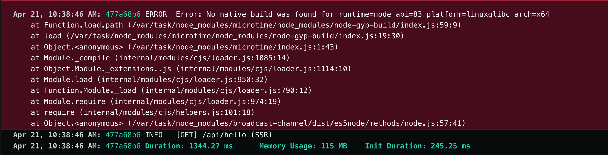

# CustomAuth Causing Runtime Error On Netlify Serverless Functions Environment

## Screenshot

## Endpoint
https://friendly-halva-6229ac.netlify.app/api/hello
## Related Issues
- https://github.com/nhost/nhost/issues/419
